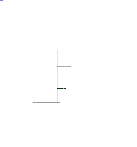

# school_uav

---

## 0. Installation

---

```
pip install -r requirements.txt
```

## 1. Create the environment

---


You can use this web site to draw the environement like this https://jspaint.app/

- draw ways in black
- draw start in red
- draw classes in green
- draw in the first line in blue the estimated 1 meter (to obtain a good speed of the drone)



## 2. Counting mission

---

```
export PYTHONPATH=$PYTHONPATH:$(pwd)
python src/run.py count {map.png}
```

## 3. Reconnaissance mission

---

### 3.1. Create classes directory

---

```
mkdir classes
```

inside add folders in classes where you could add student faces

### 3.3. Run

```
export PYTHONPATH=$PYTHONPATH:$(pwd)
python src/run.py reco {map.png}
```